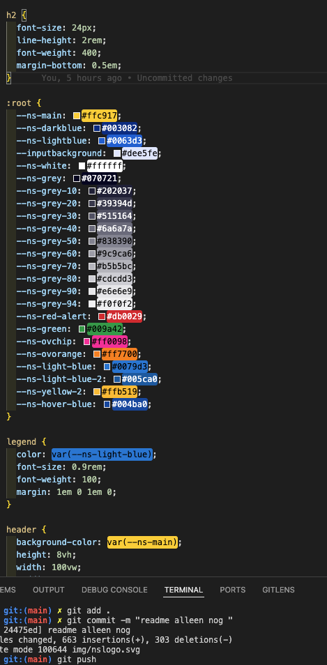

** Opdracht**

Voor het vak Browser Tech is de opdracht om een belastingformulier te ontwerpen dat qua stijl aansluit bij die van de NS. De nadruk ligt op het schrijven van semantische HTML en het toegankelijk houden van het formulier via progressive enhancement. Dit betekent dat het formulier volledig bruikbaar moet blijven, zelfs als JavaScript is uitgeschakeld. Daarnaast is het belangrijk om een prettige gebruikerservaring te bieden, met duidelijke foutmeldingen en feedback die aansluit bij wat de gebruiker ziet en begrijpt.

** Onderzoek**
Voor onderzoek heb ik goed geluisterd tijdens de lessen. We kregen hier namelijk uitleg over HTML-elementen en hun functies, die ik nog nooit had gehoord. We kregen vervolgens ook een fysieke versie van het erfbelastingformulier, en toen merkte ik pas wat een dik pak papier dat is. Ik vond het in eerste instantie al moeilijk om te kiezen wat ik nou überhaupt wilde gaan laten zien.

Voor de opdracht moeten we de Huisstijl van de NS aanhouden. Ik heb op de website hun root kunnen vinden en die heb ik dan ook gebruikt, tevens heb ik de styling van bevoorbeeld buttons kunnen gebruiken.

