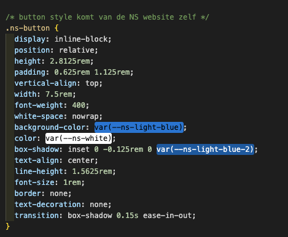
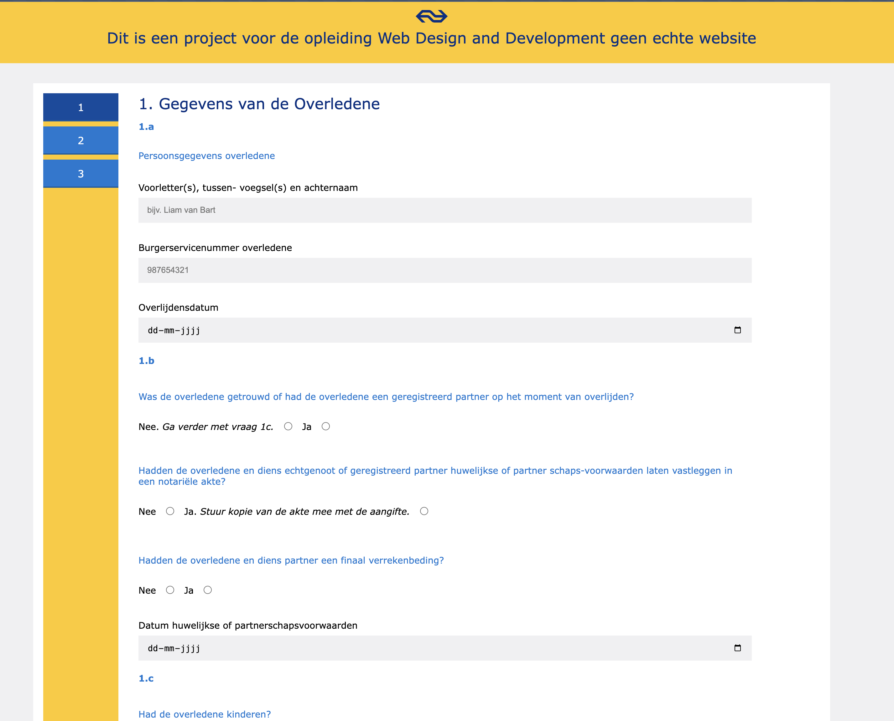
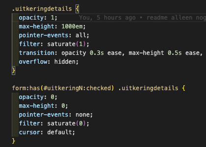
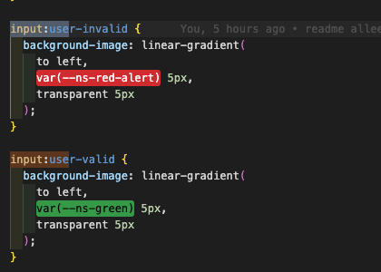
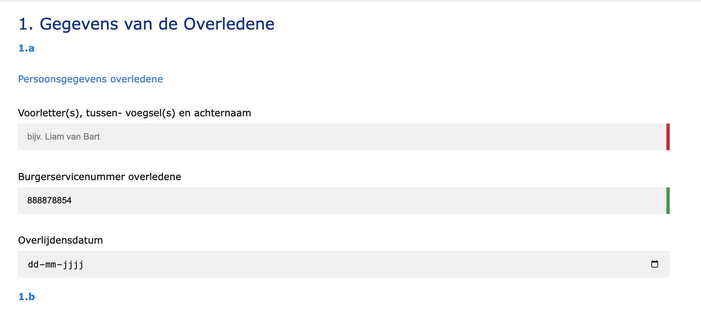

\*\* Opdracht

Voor het vak Browser Tech is de opdracht om een belastingformulier te ontwerpen dat qua stijl aansluit bij die van de NS. De nadruk ligt op het schrijven van semantische HTML en het toegankelijk houden van het formulier via progressive enhancement. Dit betekent dat het formulier volledig bruikbaar moet blijven, zelfs als JavaScript is uitgeschakeld. Daarnaast is het belangrijk om een prettige gebruikerservaring te bieden, met duidelijke foutmeldingen en feedback die aansluit bij wat de gebruiker ziet en begrijpt.

\*\* Onderzoek

Voor onderzoek heb ik goed geluisterd tijdens de lessen. We kregen hier namelijk uitleg over HTML-elementen en hun functies, die ik nog nooit had gehoord. We kregen vervolgens ook een fysieke versie van het erfbelastingformulier, en toen merkte ik pas wat een dik pak papier dat is. Ik vond het in eerste instantie al moeilijk om te kiezen wat ik nou überhaupt wilde gaan laten zien.

Voor de opdracht moeten we de Huisstijl van de NS aanhouden. Ik heb op de website hun root kunnen vinden en die heb ik dan ook gebruikt, tevens heb ik de styling van bevoorbeeld buttons kunnen gebruiken.

Ik heb gebruik gemaakt van NS haar eigen font namelijk NS sans(Voor copyright redenen laten we die in de .gitignore staan.) met Segoe UI, Myriad, Verdana, sans-serif als fallbacks. Ik heb net als de NS voor een blokkerige stijl gekozen en heb het overzichtelijk gehouden. Ik heb gekozen voor blauwe Legends en zwarte tekst voor het antwoord op de vragen zo is het duidelijk te zien wat er wel of niet bij elkaar hoort.

Ik heb geluisterd naar de docenten en heb een aantal technieken gebruikt om het PE echt goed te houden. Daarom kan ik ook trots zeggen dat zelfs als CSS en JS uit staan ik nog steeds een goed fucntionerende website heb. Dit is bijvoorbeeld iets wat ik heb gedaan bij vakken die eventueel verborgen kunnen worden. In plaats van de vakken standaard te verbergen heb ik ervoor gekozen om ze in eerste instantie te laten en zien en pas wanneer de gebruiker een optie aanvinkt die zegt nee dan pas te verbergen. Hierdoor blijft het altijd goed bruikbaar

\*\*\ Validatie

Voor validatie heb ik iets subtiels toegevoegd wat aangeeft of het veld goed of niet goed is ingevuld. Eerst deed ik dit met input invalid of input valid alleen ik kwam erachter dat dit meteen gebeurde ookal had de user nog niks met het scherm gedaan daarom heb ik gekozen voor input:user-invalid en input:user-valid dit zorgt ervoor dat de feedback alleen verschijnt wanneer de user interactie heeft gehad met de pagina.

